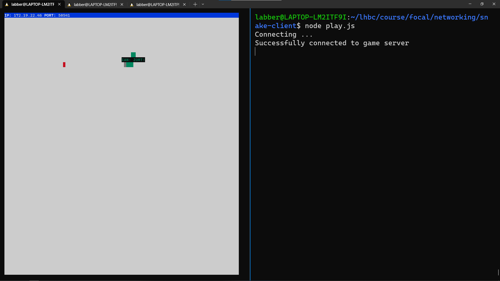
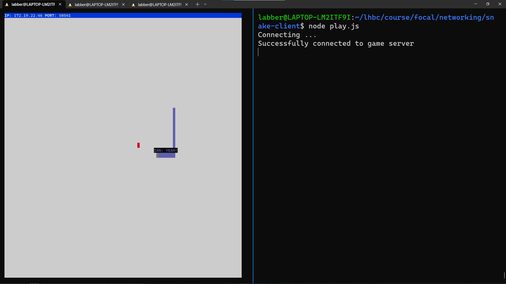

# **Snake Client Project** 🐍

[Snake](https://en.wikipedia.org/wiki/Snake_(video_game_genre) 'Wikipedia link to the Snake Game') game is a very popular video game. It is a video game concept where the player maneuvers a dot and grows it by ‘eating’ pieces of food. As it moves and eats, it grows and the growing snake becomes an obstacle to smooth maneuvers. The goal is to grow itt to become as big as possible without bumping into the side walls, or bumping into itself, upon which it dies.

This is simply a multiplayer take on the genre.

Before you can run this client, you will need to be running the server side which you can download and install from [here](https://github.com/lighthouse-labs/snek-multiplayer 'link to github repo'). 

## **Final Product**

## **Getting Started**

- Follow steps inside the snek server repo to run the server side
- Run the development snake client using the `node play.js` command.
- On another terminal from within the "snek-multiplayer" directory run `npm run play`

## **Tips (for Windows users) 😉🏠**

- On windows Terminal you can right-click on the tab you are on and then select 'Split Tab', that way you can have the Server and the Client nicely sitting next to each other (as seen in the screenshots). 
- You can also use the `Alt + arrowKey` to switch focus between split tabs. 
- I mapped the key combination `Ctrl + Alt + arrowKey-down` to split the tab I'm working on.
- To close a split tab, focus it and use `Ctrl + Shift + W`.

## **Game-play**

- Use w, s, a, d, keys on your keyboard to move the snake around
- Use the 'm' key to make your snake speak like Pinky, from the epic cartoon Pinky and The Brain.

